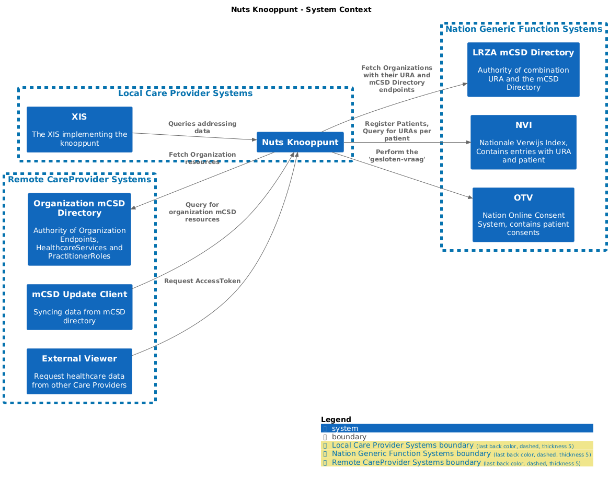
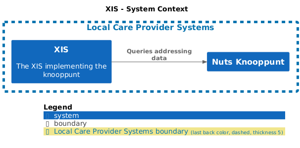
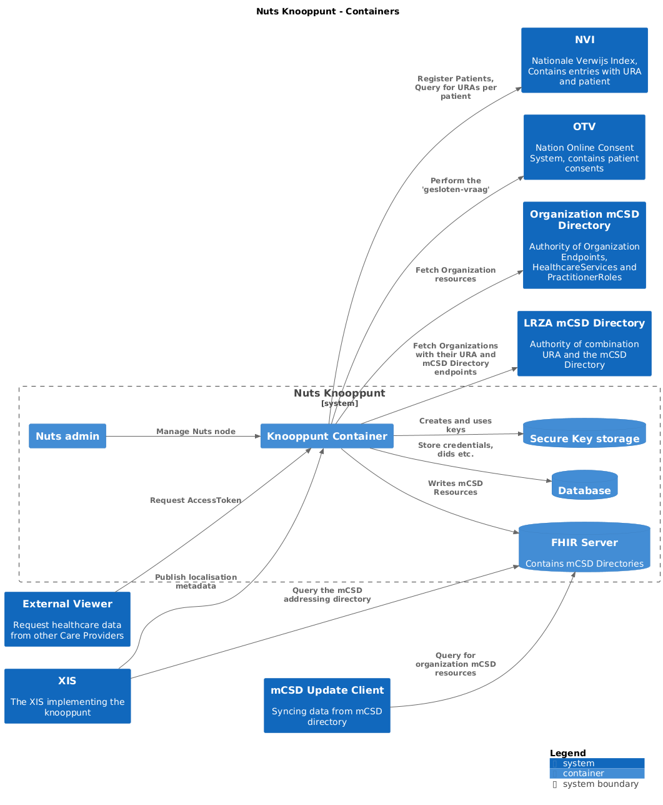
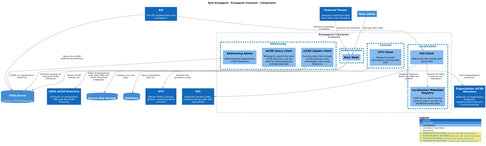

# nuts-knooppunt

Implementation of the Nuts Knooppunt specifications

## Running

Using Docker:

```shell
docker build . --tag nutsfoundation/nuts-knooppunt:local
docker run -p 8080:8080 nutsfoundation/nuts-knooppunt:local
```

## Endpoints

- Landing page: [http://localhost:8080](http://localhost:8080)
- Health check endpoint: [http://localhost:8080/health](http://localhost:8080/health)

## Go toolchain

It's a typical Go application, so:

```shell
go test ./...
```

and:

```shell
go build .
./nuts-knoopppunt
```

## Development stack

A docker compose config is provided to run a set of services that are useful for development:

- HAPI server, multi-tenancy enabled, using UUIDs, running on port 8080
- PostgreSQL database, for the HAPI server

Start the stack with:

```shell
docker compose -f docker-compose.dev.yml up
```

## Architecture Diagrams

The C4 architecture diagrams are automatically generated from the Structurizr DSL definition in [`docs/c4-diagram.structurizr`](docs/c4-diagram.structurizr). To generate them locally
run the following command:

```bash
docker run --rm -v "$(pwd)/docs":/docs extenda/structurizr-to-png --path c4-diagram.structurizr --output images
```

### System Landscape


### System Context - Nuts Knooppunt


### System Context - XIS


### Container Diagram


### Component Diagram
