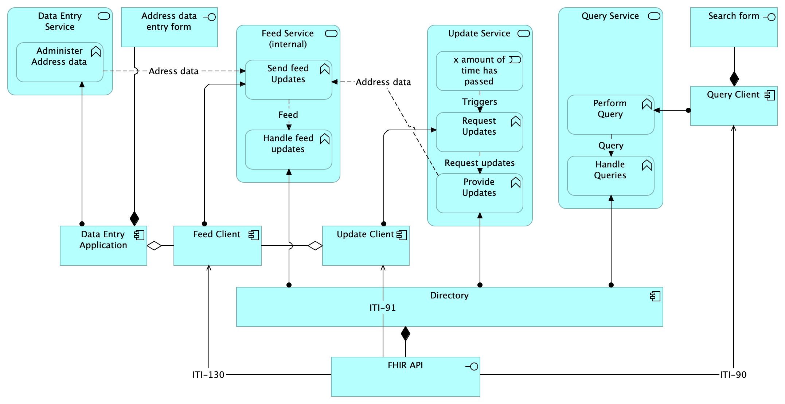

# Architecture documentation

The GF Adressing follows the IHE [mCSD profile](https://profiles.ihe.net/ITI/mCSD/index.html).

## Application services

The Application has the following services:

- Data entry service: Entering data into a directory.
- Query service: Querying data from the directory.
- Update service: Updating data in the directory.
- Feed service: Feeding data into the directory.

## Query process

The query process is as follows:

The actor `Care Giver` performs an action which requires a query to the `Directory Service`. This is performed by the `Query Client` which sends a query to the `Directory`. The directory processes the query and returns the results back to the client.

The query process is descibed in the IHE mCSD [ITI-90](https://profiles.ihe.net/ITI/mCSD/ITI-90.html) transaction.

