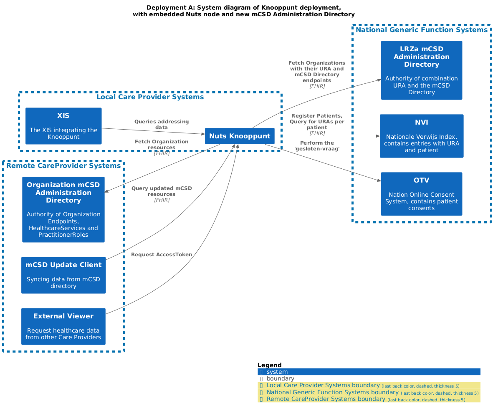
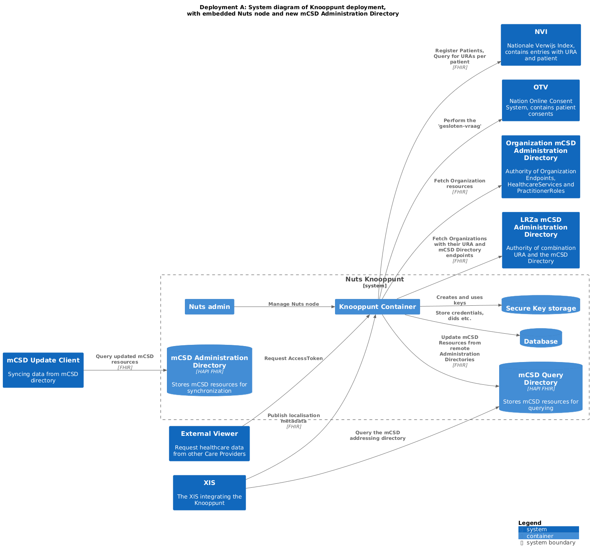
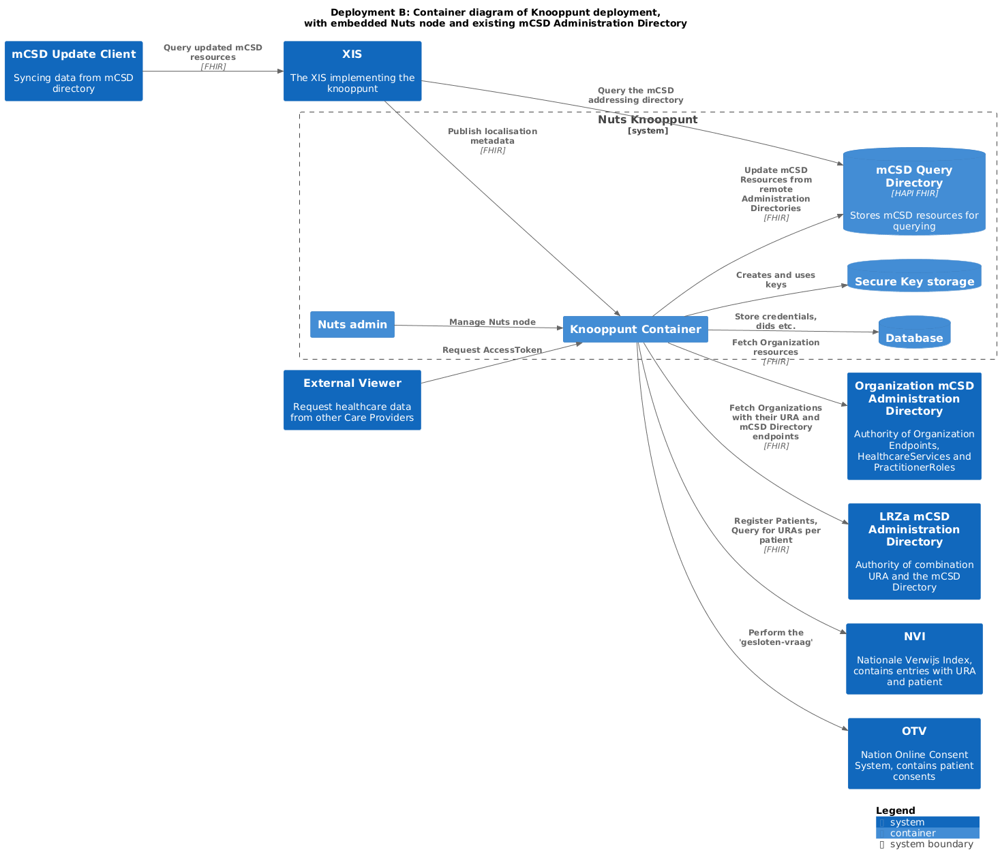
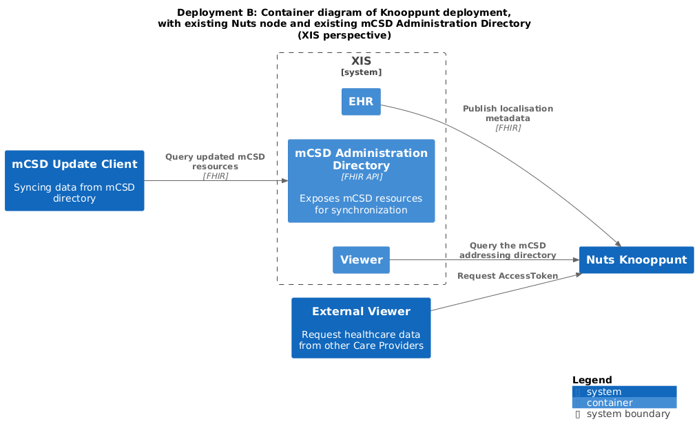
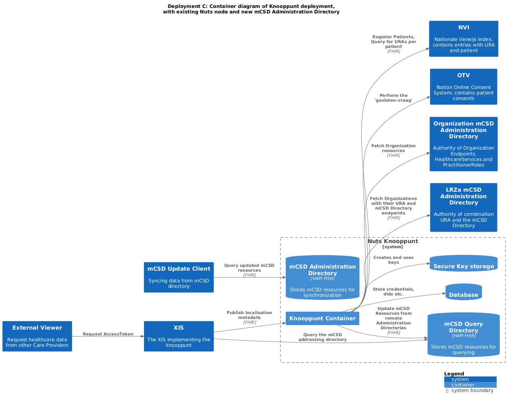
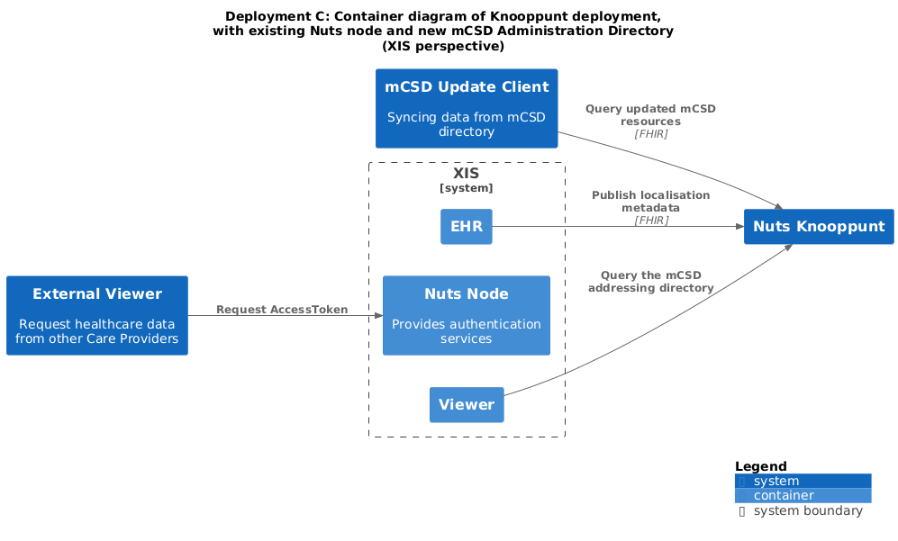

# Documentation

The diagrams on this page were created using [Structurizr](https://structurizr.com/), files are generated using `generate.sh`.

## Overview

## Deployments

This chapter describes several supported deployment options. There is a base deployment (version "A"),
and two variants (versions "B" and "C") that are intended for vendors who want to build on existing systems.

### Deployment "A"
Embedded Nuts node, "new" mCSD Query and Administration directories in the form of a HAPI FHIR server.
The vendor uses either the embedded mCSD Admin (web-)Application or the mCSD Administration Directory FHIR API to manage the mCSD entries.

### Deployment "B"
A variant of version "A" that uses an mCSD Administration Directory that is not managed through the embedded mCSD Admin (web-)Application.
This is often a facade on an existing care organization/endpoint database or API.

Intended for: vendors that have an existing system to administer care organization/endpoint information.

The following diagram shows the services involved from the Knooppunt's perspective:

The following diagram shows the services involved from the XIS' perspective:

### Deployment "C"
A variant of version "A" that uses an existing Nuts node, instead of the embedded Nuts node.

The following diagram shows the services involved from the Knooppunt's perspective:

The following diagram shows the services involved from the XIS' perspective:

