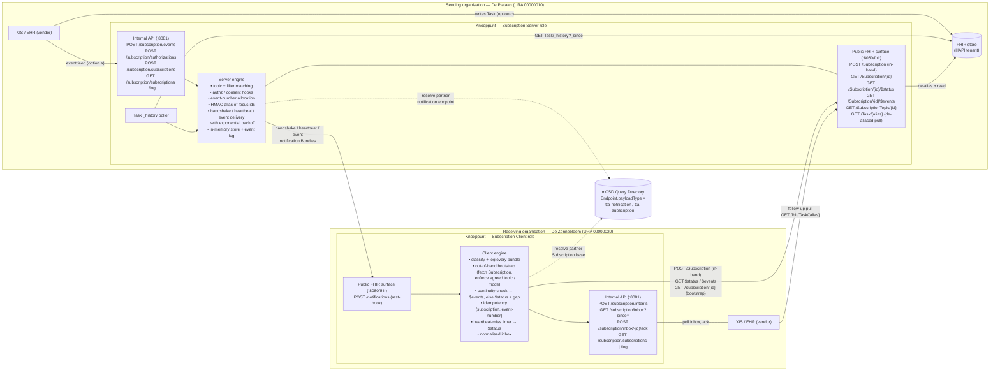
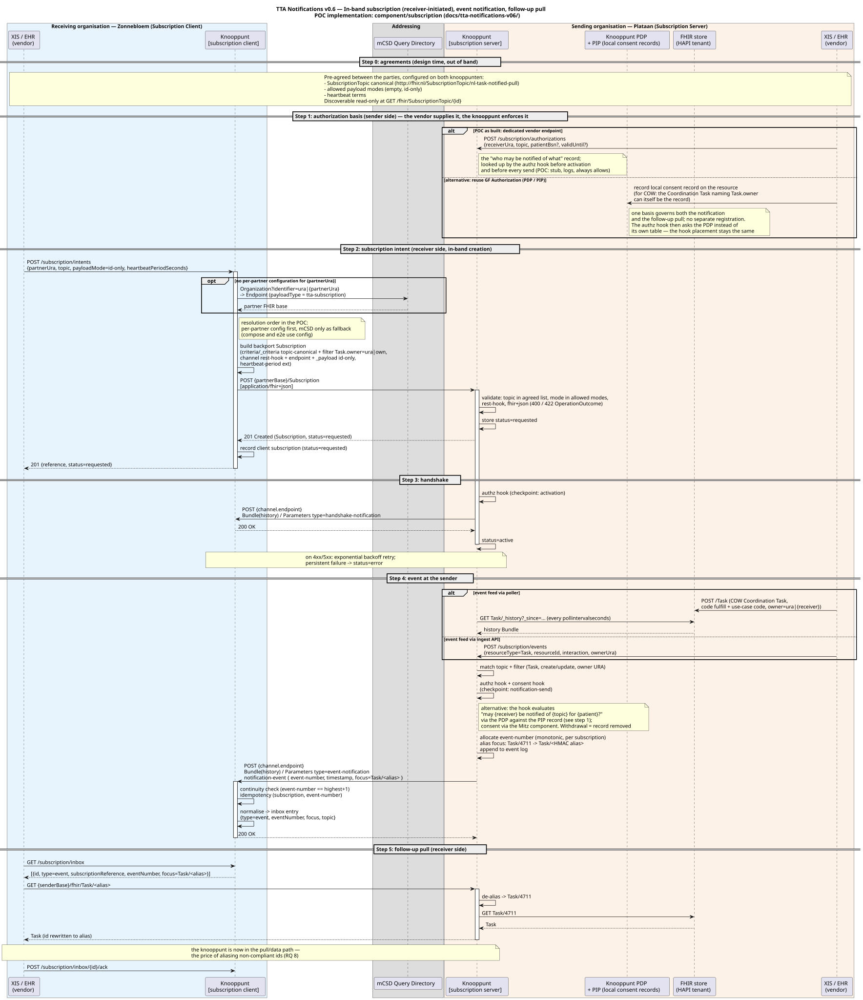
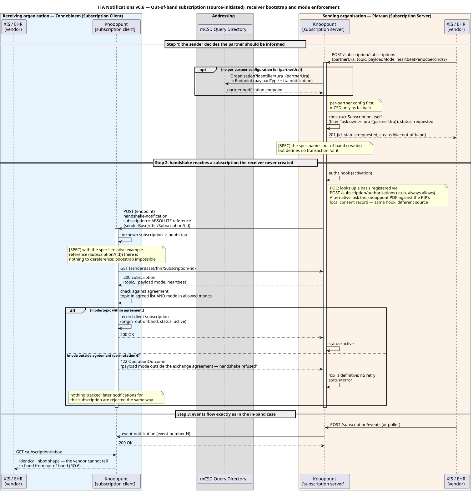
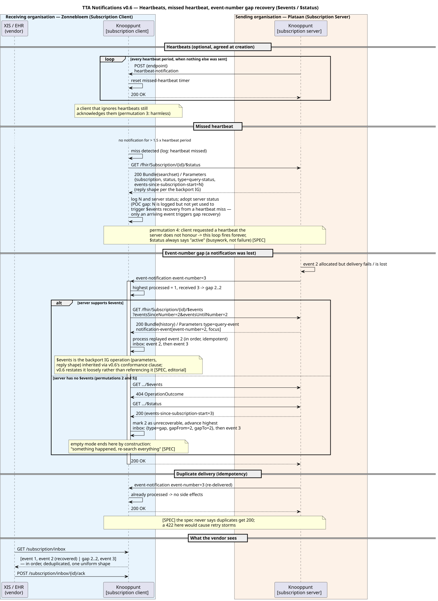

# POC architecture — TTA Notifications v0.6 in the knooppunt

How the pieces fit, as implemented on branch `tta-notifications-v06`. Companion to
[PLAN.md](PLAN.md) (why) and [FINDINGS.md](FINDINGS.md) (what we learned).

- Sequence diagrams (PlantUML, repo convention), rendered below and via `docs/generate.sh`:
  [../tta-notifications-inband-sd.puml](../tta-notifications-inband-sd.puml),
  [../tta-notifications-outofband-sd.puml](../tta-notifications-outofband-sd.puml),
  [../tta-notifications-recovery-sd.puml](../tta-notifications-recovery-sd.puml).
- Editable architecture drawing: [architecture.excalidraw](architecture.excalidraw "width=1100 height=720")

## The two-node picture

Every organisation runs its own knooppunt. The knooppunt owns the whole
cross-organisation protocol on its **public** interface; the organisation's XIS/EHR
(the vendor) only ever talks plain JSON to the **internal** interface. One knooppunt can
run either role or both; the demo runs Plataan as Subscription Server and Zonnebloem as
Subscription Client.

## Reading guide

| Concern | Where it lives | Notes |
|---|---|---|
| Wire types (backport Subscription, SubscriptionTopic, notification Bundle) | `lib/fhirsubscription` | Hand-written; the R4 Go model can't express the backport primitive extensions |
| Public FHIR surface | `subscription-public.openapi.yaml` → `api/subscriptionpublic`, handlers in `component/subscription/public.go` | Mounted on the public mux like `/mitz/notify` |
| Vendor contract | `openapi.yaml` (tag `subscription`) → `api`, handlers in `component/subscription/api.go`, forwarders in `cmd/apiserver.go` | Plain JSON, no FHIR knowledge required |
| Server engine | `component/subscription/server.go`, `deliver.go`, `poller.go`, `alias.go`, `topic.go`, `resolve.go`, `authz.go` | |
| Client engine | `component/subscription/client.go` | |
| State | `component/subscription/store.go` | One mutex, in-memory — POC limitation |
| Permutation tests | `test/e2e/subscription` | Two in-process knooppunten per test |
| Demo | `docker-compose.yml` (`knooppunt` + `knooppunt-zonnebloem`), `docs/test-scripts/tta-notifications.http` | |

## Authorization basis: two ways to supply it

The spec obliges the server to verify the receiver's authorization before activating a
subscription and again before every send, but puts nothing on the wire (unlike TA NP's
`authorization-base` token). So the *basis* has to originate in the sender's system, where
the care relationship or order is created, and reach the knooppunt somehow. The POC and
the intended production shape differ here:

| | POC (as built) | Alternative (intended production shape) |
|---|---|---|
| How the vendor supplies the basis | Dedicated internal endpoint `POST /subscription/authorizations` `{receiverUra, topic, patientBsn?, validUntil?}` | The **existing GF Authorization path**: the vendor records a local consent record on the resource in the PIP (the same record that governs the follow-up pull); for COW the Coordination Task naming the `owner` can itself be that record |
| Who evaluates | Stub hook in `component/subscription/authz.go`: looks up the registered basis, logs it, **always allows** | The knooppunt **PDP** evaluates the hook's question (may receiver X be notified about topic T for patient Y?) against the PIP, exactly as it evaluates the pull |
| Withdrawal | `validUntil` passes, or the basis is never registered | Remove the record / cancel the Task / restriction period expires — notifications stop at the next per-send check |
| Why it exists | Makes the vendor obligation explicit and testable; shows the hook placement (research question 5) | One basis governs both the notification and the data access; no second registration for vendors |

The endpoint would most likely not survive as a separate API in production; the hook
placement is what carries over. Both variants are drawn in the in-band sequence diagram
below (step 1 and step 4).

## Sequence diagrams

### 1. In-band subscription, event notification, follow-up pull (happy path)

### 2. Out-of-band subscription, receiver bootstrap, mode enforcement

### 3. Heartbeats, missed heartbeat, gap recovery via `$events` / `$status`

## The layered model, in one line each

1. **Agreement** (design time): topic canonical, payload modes, heartbeat terms — configuration on both sides, never negotiated on the wire.
2. **Subscription**: created in-band (receiver POSTs it) or out-of-band (sender builds it); `requested` until the handshake succeeds, then `active`.
3. **Notification**: `history` Bundle with a SubscriptionStatus `Parameters`; carries only *that* something happened (and, in id-only, an opaque reference).
4. **Recovery**: event numbers make gaps detectable; `$events` replays, `$status` tells you where the server is; heartbeats make silence detectable.
5. **Pull**: the receiver fetches the actual resource from the sender — through the knooppunt when ids had to be aliased.
