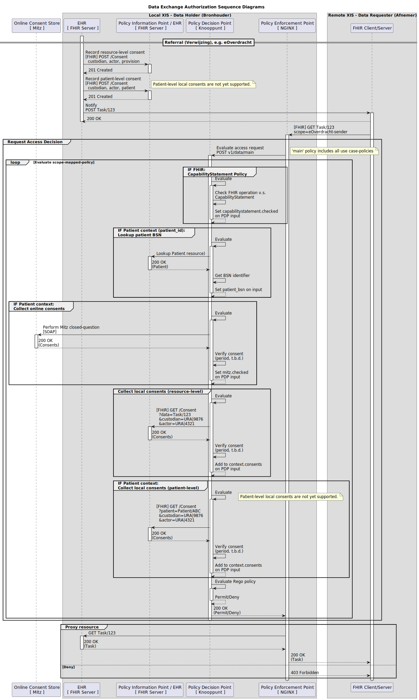

# Policy Enforcement Point (PEP)

NGINX-based reference implementation that enforces authorization decisions from Knooppunt's PDP.

## Architecture



The PEP uses nginx subrequests to proxy calls to Nuts node and PDP via internal locations.

## Quick Start

```bash
# Start PEP with rest of stack
docker compose --profile pep up -d

# Test requires a valid OAuth token from Nuts node
# The PEP will introspect the token and validate DPoP if present
```

**Endpoints:**
- PEP: `http://localhost:9080`
- PDP: `http://localhost:8081/pdp` (internal API)

## How It Works

1. Extract bearer/DPoP token from `Authorization` header
2. Introspect token via Nuts node `/internal/auth/v2/accesstoken/introspect` (RFC 7662)
3. Validate DPoP binding if token has `cnf.jkt` claim via `/internal/auth/v2/dpop/validate` (RFC 9449)
4. Pass introspection claims directly to PDPInput (no mapping - PD defines claim names)
5. Call Knooppunt PDP for authorization decision
6. Enforce decision: allow (200) or deny (403)

## Configuration

Environment variables in `docker-compose.yml`:

```yaml
# FHIR API path exposed by PEP (default: /fhir)
FHIR_BASE_PATH=/fhir
# FHIR path on backend server (default: same as FHIR_BASE_PATH)
# Use for HAPI multi-tenancy: /fhir/DEFAULT
FHIR_UPSTREAM_PATH=/fhir

# Backend connections
FHIR_BACKEND_HOST=hapi-fhir
FHIR_BACKEND_PORT=7050
KNOOPPUNT_PDP_HOST=knooppunt
KNOOPPUNT_PDP_PORT=8081

# Nuts node connection (Authorization Server)
NUTS_NODE_HOST=knooppunt
NUTS_NODE_INTERNAL_PORT=8081

# Data holder (this organization)
DATA_HOLDER_ORGANIZATION_URA=00000666
DATA_HOLDER_FACILITY_TYPE=Z3

# Security: Configure expected hostname for DPoP URL validation
# Prevents Host header spoofing attacks. Falls back to Host header if not set.
PEP_HOSTNAME=pep.example.com
```

## Presentation Definition

The Presentation Definition (PD) is configured on the authorization server (Nuts node), not in the PEP.
For BgZ use cases, the PD typically requires:

1. **X509Credential** - Organization identity with URA number
2. **HealthcareProviderRoleTypeCredential** - Vektis facility type
3. **NutsEmployeeCredential** - Employee identity for Mitz consent verification

See `test/e2e/pep/testdata/accesspolicy.json` for an example PD used in e2e tests.

## Claim Flow (No Mapping Required)

Claims flow directly from the Presentation Definition to the PDP without any mapping in the PEP:

```
Verifiable Credentials    Presentation Definition    Introspection Response    PDPInput
        │                         │                          │                    │
        │    ┌────────────────────┘                          │                    │
        ▼    ▼                                               │                    │
   VC claims extracted using PD field constraints ──────────►│                    │
        │                                                    │                    │
        │    The `id` field in each PD constraint            │                    │
        │    becomes the claim name in introspection         │                    │
        │                                                    ▼                    │
        │                                              { "active": true,          │
        │                                                "subject_id": "...",     │
        │                                                "subject_role": "..."    │
        │                                              }                          │
        │                                                    │                    │
        │                                                    │  passed through    │
        │                                                    └───────────────────►│
```

The PEP passes claims directly from introspection to the PDP. **The Presentation Definition must use
`id` fields that match what the PDP expects.**

### PD Constraint IDs (for PDP/Mitz)

The PEP passes all non-standard claims through to the PDP. The PDP expects these `id` values in the PD constraints:

| PD Constraint `id` | VC Path Example | Description |
|--------------------|-----------------|-------------|
| `subject_id` | `$.credentialSubject.identifier` | Employee/practitioner identifier |
| `subject_role` | `$.credentialSubject.roleName` | Role code (e.g., "Medisch Specialist") |
| `subject_organization_id` | `$.credentialSubject.san.otherName` | URA number |
| `subject_organization` | `$.credentialSubject.subject.O` | Organization name |
| `subject_facility_type` | `$.credentialSubject.roleCodeNL` | Vektis facility type code |

Additionally, the PDP receives from OAuth:
- `client_id` - OAuth client identifier (DID)
- `scope` - OAuth scopes (converted to `client_qualifications` array)

## PDPInput Format

The PEP sends requests matching the Go `PDPInput` struct:

```json
POST /pdp

{
  "input": {
    "subject": {
      "type": "organization",
      "id": "did:web:example.com",
      "properties": {
        "client_id": "did:web:example.com",
        "client_qualifications": ["bgz"],
        "subject_id": "000095254",
        "subject_role": "medical-specialist",
        "subject_organization_id": "87654321",
        "subject_organization": "Test Hospital B.V.",
        "subject_facility_type": "Z3"
      }
    },
    "request": {
      "method": "GET",
      "protocol": "HTTP/1.1",
      "path": "/Condition",
      "query_params": {"patient": ["Patient/patient-123"]},
      "header": {},
      "body": ""
    },
    "context": {
      "data_holder_organization_id": "12345678",
      "data_holder_facility_type": "Z3",
      "patient_bsn": ""
    }
  }
}
```

**Expected response:**
```json
{
  "result": {
    "allow": true,
    "reasons": []
  }
}
```

## DPoP Token Binding

When the introspection response includes a `cnf.jkt` claim, the PEP validates DPoP:

1. Extracts `DPoP` header from request
2. Calls Nuts node `/internal/auth/v2/dpop/validate` via internal subrequest
3. Returns 401 if validation fails

This ensures the access token is bound to the client's proof-of-possession key.

## Testing

### Unit Tests

```bash
cd pep/nginx/js
npm install
npm test
```

### E2E Tests

```bash
# Run from repository root
go test ./test/e2e/pep/... -v
```

The e2e test (in `test/e2e/pep/authorization_test.go`):
1. Starts Nuts node and HAPI FHIR containers, Knooppunt PDP in-process, and PEP container
2. Issues X509Credential, NutsEmployeeCredential, and HealthcareProviderRoleTypeCredential
3. Requests an access token with scope `bgz`
4. Tests the full PEP authorization flow with real credential validation

## Implementation Details

- **nginx/nginx.conf** - Main NGINX config (rate limiting, request size limits)
- **nginx/conf.d/knooppunt.conf** - PEP routes and upstreams
- **nginx/js/authorize.js** - Authorization logic (NJS)
- **nginx/js/authorize.test.js** - Unit tests for authorization logic

## Production Notes

The PEP requires:
1. **Nuts node** with:
   - Introspection endpoint at `/internal/auth/v2/accesstoken/introspect`
   - DPoP validation endpoint at `/internal/auth/v2/dpop/validate`
2. **Presentation Definition** configured on the authorization server (Nuts node) with claim IDs matching what the PDP expects
3. **PDP** with policies matching the scopes/qualifications in the access tokens

**Limitations:**
- **Single-tenant only**: This PEP supports a single FHIR backend. Multi-tenant setups (e.g., HAPI multi-tenancy) are not supported because the PDP has no tenant context for patient lookups and consent checks. Deploy separate PEP instances per tenant if needed.

**Considerations for production:**
- **Claim forwarding**: This PoC forwards all non-standard introspection claims to the PDP. In production, consider explicitly allowlisting which claims to forward based on the Presentation Definition, rather than forwarding everything.
- **Log security**: PEP logs contain OAuth metadata (client_id, scope) and error details for debugging. Ensure appropriate log access controls and retention policies.
